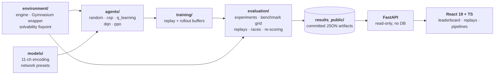

<div align="center">

# RL Minesweeper Lab

### Five agents. One environment. One evaluation protocol.

[](https://www.python.org/)
[](https://pytorch.org/)
[](https://gymnasium.farama.org/)
[](https://fastapi.tiangolo.com/)
[](https://react.dev/)
[](rl/tests)

**[Live benchmark, replays & research write-up →](https://rl-minesweeper-lab.vercel.app/)**

</div>

Deduction, memorisation, value learning and policy gradient, benchmarked against each other on one
partially observable board. The question is not *can RL play Minesweeper* — it is **what a learned
policy buys you over explicit search on a problem that is partly provable and partly a bet.**

<div align="center">

**Headline result** · 5×5, 5 mines, protected opening, 2,000 shared evaluation boards

| DQN — Double, `fully_conv` | CSP — explicit deduction | Margin |
|:---:|:---:|:---:|
| **77.25%** <br><sub>95% CI [75.4, 79.0]</sub> | 70.35% <br><sub>95% CI [68.3, 72.3]</sub> | **+6.90 pts** <br><sub>disjoint intervals</sub> |

*A learned value function beat a solver that **proves** cells safe.*

<sub>37 committed runs · 2.73M training episodes · 132,000 evaluation games · 18 board configurations<br>
Every figure is read from the JSON the training scripts wrote — none is hand-typed.</sub>

</div>

---

## Why Minesweeper

It splits cleanly into two regimes most RL benchmarks blend together. A revealed `2` with exactly two
hidden neighbours **proves** both are mines — no policy needed. Elsewhere several mine layouts fit the
same clues and every move is a bet with a computable probability of death.

So an agent can be scored separately on *how much of the board it can reason about* and *how well it
bets when reasoning runs out* — and because a search baseline is provably correct in the first regime,
"did learning help?" has a real answer. Sparse terminal reward, one irreversible action class and a
state space combinatorial in board area do the rest.

---

## The agents

| Agent | Core idea | What it tests |
|---|---|---|
| **Random** | Uniform over hidden cells | The floor every other number is read against |
| **CSP** | Constraint propagation to a fixpoint (single-constraint + subset rules), probability fallback when stuck | Explicit deduction, no learning |
| **Q-Learning** | Tabular values keyed on the exact board pattern | Memorisation with zero generalization |
| **DQN** | Double DQN, 11-channel encoding, replay buffer + target network | Learned value approximation |
| **PPO** | Actor-critic, GAE(λ), clipped surrogate, entropy bonus | On-policy policy learning |

DQN and PPO share the encoding, the network presets and the episode budget, so comparing them
compares algorithms rather than inputs.

---

## Results

**v2** guarantees a mine-free 3×3 around the opening click; **v1** places mines first, so the opening
move can lose outright. They are different games — never subtract one from the other.

| Agent | **v2 · opening safe** | v1 · opening can lose |
|---|---|---|
| **DQN** — Double, `fully_conv` | **77.25%** | 38.55% |
| **Q-Learning** — tabular | 71.70% | 1.90% |
| **CSP** — deduction | 70.35% | **43.40%** |
| **PPO** — actor-critic | 7.90% | 1.75% |
| **Random** | 1.30% | 0.45% |

**Q-Learning draws level with the solver** — 71.70%, p = 0.35 — with no generalization whatsoever:
unseen board, all-zero values, random move. A protected 5×5 opening simply repeats often enough to
memorise, and the same table collapses to 1.90% on `v1`. The number that looks like competence is
really a measurement of how narrow the benchmark cell is.

<details>
<summary><b>Full benchmark grid — 3 board sizes × 3 densities</b></summary>

**v2 (opening safe)** · DQN/PPO are trained once per level at standard density and evaluated at the
other two without retraining, so density is the only variable within a row.

| Board | Mines | Random | Q-Learning | PPO | DQN | CSP |
|---|---|---|---|---|---|---|
| Beginner 5×5 | 3 | 10.20% | **91.20%** | 29.85% | 89.40% | 91.10% |
| | 5 | 1.30% | 71.70% | 7.90% | **77.25%** | 70.35% |
| | 8 | 0.15% | 0.60% | 0.95% | **38.90%** | 36.45% |
| Intermediate 9×9 | 8 | 0.10% | — | 0.70% | 97.05% | **98.55%** |
| | 12 | 0.00% | — | 0.00% | 80.15% | **89.95%** |
| | 18 | 0.00% | — | 0.00% | 25.45% | **46.85%** |
| Expert 16×16 | 30 | 0.00% | — | — | — | **95.05%** |
| | 40 | 0.00% | — | — | — | **81.25%** |
| | 60 | 0.00% | — | — | — | **12.75%** |

Dashes are *unmeasured*, not zero: Q-Learning is deliberately capped at 5×5 (at 9×9 essentially no
state ever repeats), and no learned agent has an Expert run under the current recipe.

</details>

> **The `v1` grid, tuning pipelines, ablations, transfer experiments and per-move replays live on the
> [Research page →](https://rl-minesweeper-lab.vercel.app/)** and in [`rl/analysis/`](rl/analysis).

---

## Implementation

**State representation — 11 one-hot channels** ([`rl/models/dqn_network.py`](rl/models/dqn_network.py)).
A hidden mask, a revealed mask, one channel per adjacent-mine count 0–8. Clue numbers are
*categorical*: with a single scalar channel, −1 (hidden) sits numerically adjacent to 0 (revealed, no
neighbours) — the two states it matters most to separate. One-hot makes that distinction structural
instead of something the network must first learn to disentangle.

**Legal-action masking, in two places.** Selection masks revealed cells to −∞. Less obviously, so does
the **Double DQN target**: revealed cells never appear as actions, so their Q-values are never trained
and drift freely — an unmasked `argmax` selects one and the target network scores a fantasy.
Restricting the argmax to the hidden set `H` fixes it:

$$y = r + \gamma\, Q_{\theta^-}\!\left(s',\ \arg\max_{a' \in \mathcal{H}(s')} Q_{\theta}(s', a')\right)$$

Online network picks, target network scores, and the pick is confined to legal cells.

**Fully-convolutional Q-network.** The flatten-and-Linear head is 94% of the network at 5×5 and
**99.4%** at 16×16. A 1×1 conv head replaces it — same depth, board-size invariant, and deduction
rules become translation-equivariant, so *"a `1` with one hidden neighbour"* is learned once instead
of separately per position.

| Preset | 5×5 | 9×9 | 16×16 |
|---|---|---|---|
| `default` — Linear head | 111,993 | 348,593 | 1,087,968 |
| **`fully_conv`** — 1×1 conv head | **29,089** | **29,089** | **29,089** |

<details>
<summary>More implementation details — rewards, exploration, replay ratio</summary>

**Reward scaling is an optimisation knob, not a difficulty one.** Rewards are `+1` safe reveal, `−10`
mine, `+10` win. At ±10 essentially every TD error lands in the *linear* regime of the Huber loss,
where gradient magnitude is constant however wrong the estimate is. `reward_scale=0.1` is a positive
rescaling — optimal policy provably unchanged — that puts targets back in the range the loss was
designed for. It was worth more than any architecture change tried.

**Exploration.** ε-greedy, multiplicative per-episode decay to a 0.05 floor. The 0.995 default
exhausts exploration in ~600 episodes of a 100,000-episode run; the tuned recipe uses 0.9997.

**Replay ratio.** `train_every=4` spends the same number of gradient updates on four times as much
collected experience. A `shaped` reward mode (cascade bonus, sharper terminals) exists and is always
*evaluated* under the default reward so win rates stay comparable.

</details>

---

## Architecture



The web layer **serves** results; it is not a source of truth. Every route reads `rl/results_public/`
per request and returns exactly what the training scripts wrote. Replays never record mine positions,
not even in metadata, so hidden state cannot leak into the UI by accident.

**Engineering** — fixed evaluation protocol (2,000 greedy episodes, seed 42, identical boards across
agents, Fisher exact p-values and 95% Wilson intervals) · matched DQN/PPO gradient budget (~123k–150k
against ~343k, not the 20× deficit an unmatched configuration produces) · committed checkpoints and
subsampled histories · **424 tests** (297 RL, 127 backend).

---

## Quick start

```bash
cd rl && pip install -r requirements.txt
pytest                                        # 297 tests
python -m evaluation.evaluate_agents          # all five agents on one board

python -m evaluation.dqn_experiment --episodes 100000 --rows 5 --cols 5 --mines 5 \
  --network-size fully_conv --train-every 4 --reward-scale 0.1 --epsilon-decay 0.9997 \
  --first-click-safe area --seed 42 --eval-seed 42 --output-dir results/my_run
```

<details>
<summary>Run the web app locally</summary>

```bash
cd backend  && pip install -r requirements.txt && uvicorn app.main:app --reload   # :8000, docs at /docs
cd frontend && npm install && npm run dev                                          # :5173
```

`VITE_API_URL` points the frontend at the API. `MINESWEEPER_RESULTS_DIR` overrides which results
tree the backend serves (default `rl/results_public/`).

</details>

---

## What the experiments showed

### 1 · Environment design mattered more than tuning

The largest effect on either learned agent was never a hyperparameter — it was fixing the problem
formulation. A guaranteed-safe opening moved DQN **+22.35 points** and PPO **+6.15**, with not one line
of either agent changed; nine tuning arms between them, combined, moved less. The tuning that *did*
work only worked jointly: reward scaling plus slower exploration, applied without the reduced replay
ratio, scores **5.95% — worse than changing nothing**. Individually the three fixes sum to 48.85
points; as a bundle they are worth 16.65. Single-lever ablations here mislead.

### 2 · Search and learning fail differently

CSP is the only agent a bigger board *helps*: deductions per game climb 4.9 → 20.5 → 72.3 from
Beginner to Expert while forced guesses stay flat, taking its deduction-to-guess ratio from ~2:1 to
~37:1. More board means more structure for the constraint graph to exploit. Learned policies move the
opposite way, having to generalize over a far wider state distribution — DQN's edge over CSP
disappears entirely at 9×9, and PPO records **0 wins in 2,000** there. PPO's binding constraint is
depth, not tuning: a 9×9 win needs 69 correct reveals and its median episode ends after 5. Given
boards where a correct move always exists, PPO wins **13.30%** and DQN **99.65%** at the same
encoding, budget and architecture — off-policy replay reuses rare wins that on-policy rollouts discard.

### 3 · Architecture enabled generalization, not accuracy

`fully_conv` is a null on win rate at 5×5 — 38.55% vs 37.90%, p = 0.67 — at **26% of the parameters**.
Its value was never accuracy. Board-size invariance is the only reason a 9×9 model could be built from
the 5×5 recipe at all, and the reason a 5×5 checkpoint keeps roughly *half* its win rate zero-shot at
9×9. The measurably useless change was the enabling one.

> **Caveat.** Most configurations are single runs; seed variation reached 4.45 points, so small
> differences are treated as undecided rather than overinterpreted.

---

<div align="center">
<sub><b><a href="rl/">rl/</a></b> environment · agents · models · evaluation &nbsp;·&nbsp;
<b><a href="rl/analysis/">rl/analysis/</a></b> structural analyses &nbsp;·&nbsp;
<b><a href="backend/">backend/</a></b> read-only API &nbsp;·&nbsp;
<b><a href="frontend/">frontend/</a></b> visualization</sub>
</div>
